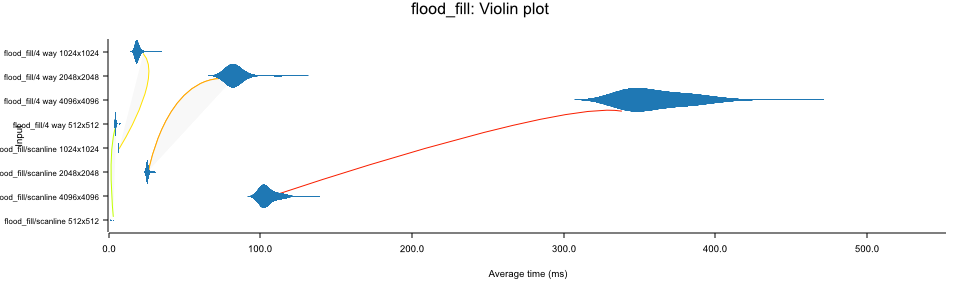

# Introduction

This is a simple playground toy for benchmark some operations on GPU buffer.
Which I interested in:
* the cost of mapping and unmapping buffer
* the cost of copy buffer
* the cost of CPU based flood fill

# Usage

```bash
cargo bench
```


Run flood fill benchmark:
```bash
cargo bench --bench benches/my_benchmark.rs -- --bench flood_fill
```

See result in `target/criterion/report/index.html`.


## About mapping and unmapping buffer

I test the cost of mapping and unmapping buffer on both dx12 and opengl.

The latest graphic api is much faster than gl.

It cost. But both of them is fast, even 4k texture.


## About flood fill benchmark

I implement 2 algorithm for flood fill:
* 4 way flood fill
* scanline flood fill

As you can see from the result, scanline flood fill is faster than 4 way flood fill.

here's result in my pc:

